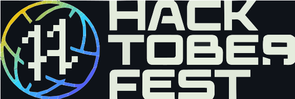

<br>
<br>

<div align ="center"><a href="https://gdsc.community.dev/lovely-professional-university-jalandhar/">  </a></div>

<br>
<br>

# About

Bot is a powerful moderation [Node.js](https://nodejs.org) bot providing utility and fun commands.

<br>

-  Google Developer Student Club - LPU is a university-based community group for students interested in Google technologies

- Students from all undergraduate or graduate programs with an interest in growing as a developer are welcome.

- By joining a GDSC, students grow their knowledge in a peer-to-peer learning environment and build solutions for local businesses and their communities.


<br>
<br>

# Table of Contents

- [Features & Commands](#Features & Commands)
    - [Fun Commands](##Fun Commands)
    - [Utility Commands](##Utility Commands)
    - [Miscellaneous Commands ](##Miscellaneous Commands)
- [Installation](#Installation)
- [Contributotors](#Contributors)

<br>
<br>

# Features & Commands
> Note: The prefix is '+'

<br>

##  Fun Commands

| Commands | Use |
| --- | --- |
| `google[content]` | fetch 9-10top results from google e.g. !google alanwalker songs, true |
| `say` | Whatever you ask it |
| `8ball` | Starts 8ball |
| `meme` | shows you random meme |
| `server` | shows server info |
| `info` | Shows info of user |
| `quote` | Sends a random quote |
| `weather[cityname]` | shows weather of a city e.g. !weather london, true, |
| `avatar` | Shows you the avatar |
| `fakevirus` | Send a virus to mentioned user |

<br>

## Utility Commands

| Commands | Use |
| --- | --- |
| `kick` | kicks the user from server |
| `ban` |bans a user from |server,
| `purge` | clears the given amount of messages |
| `private[#channel]` | make channel private |
| `lock` | locks a channel e.g. zyn-lock[#channel], true |
| `unlock` | unlocks the channel |

<br>

## Miscellaneous Commands

| Commands | Use |
| --- | --- |
| `Ping` | Shows if bot is online or not |
| `help` | Shows list of all commands |

<br>
<br>

# Installation

Install Node.Js :
```
npm install -g npm
```

<small>**Make sure Node.js 16.9.0 or newer is installed.** </small>
<br>

<hr>

* [Fork the repository](https://github.com/gdsclpu/discord-bot/fork)

<br>

* Clone your fork:
``` 
git clone https://github.com/your-username/discord-bot.git 
```
<br>

* Create your feature branch: 
```
git checkout -b my-new-feature
```
<br>

* Stage changes 
```
git add .
```
<br>

* Commit your changes: 
 ```
 git commit
 ```
 
 <br>

* Push to the branch: 
```
git push origin my-new-feature
```

<br>

* Submit a pull request

<br>
<br>

# Contributors

**Thanks To All contributors!**

<br>

<a href = "https://github.com/gdsclpu/discord-bot/graphs/contributorss">
   
</a>

<br>
<br>
<br>

 <div align="center">
 <a   target="_blank" href="https://hacktoberfest.com">
			</a>&nbsp;&nbsp;&nbsp;&nbsp;&nbsp;
        <a style="margin-left: 10px;" target="_blank" href="https://github.com/gdsclpu/discord-bot">
		</a>&nbsp;&nbsp;&nbsp;&nbsp;&nbsp;
        <a style="margin-left: 10px;" target="_blank" href="https://discord.gg/jd2aNCAHrr">
			</a>
      </div>
